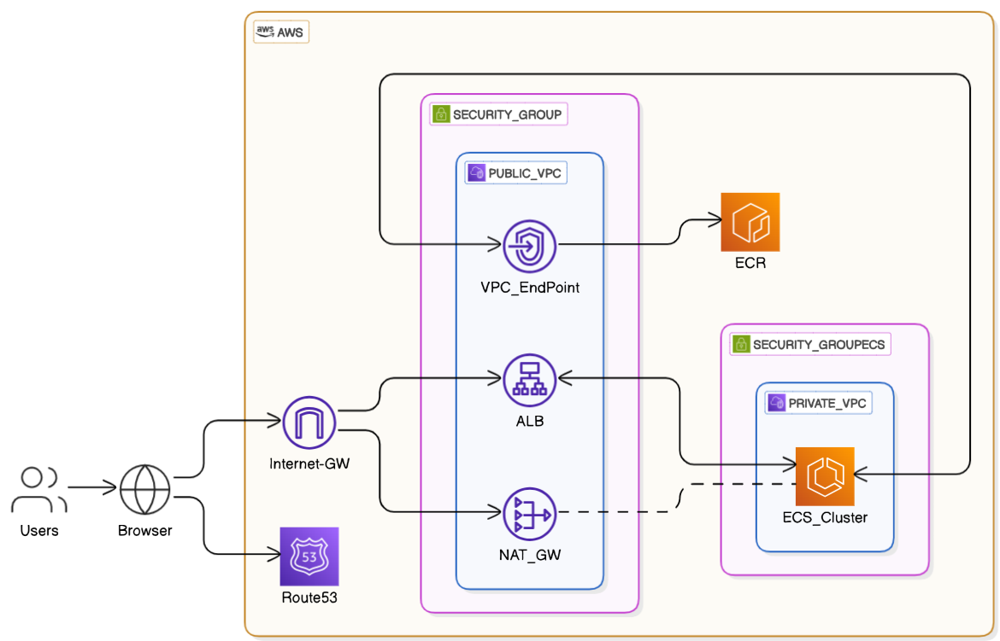

📚 Todo App

This is a serverless web application designed to allow users to Insert, modify and delete tasks. The app is deployed using modern AWS cloud infrastructure with production-grade DevOps practices such as CI/CD pipelines and infrastructure as code.

🚀 Features
✅ Insert tasks
🔍 Search pending and complete tasks
📥 Delete pending and complete tasks
🧱 Terraform-managed AWS infrastructure
🔄 CI/CD with GitHub Actions for backend, frontend, and infrastructure

☁️ AWS Services Used 
✅ S3 (storage & hosting) 
✅ ECR 
✅ ECS 
✅ Application Load Balancer 
✅ Internet GW 
✅ NAT GW 
✅ VPCs and Security Groups